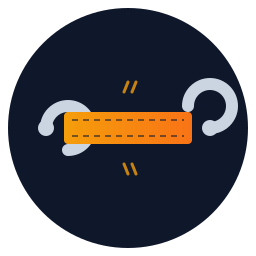

<div align="center">



# TowStrap

[](https://go.dev/)
[](https://github.com/towstrap/towstrap/actions/workflows/ci.yml)
[](LICENSE)
[]()
[]()
[](https://github.com/towstrap/towstrap/releases)

**Reverse-access system connecting users (or LLMs) to machines behind NAT**

[中文](README.md) | English

</div>

---

## Overview

TowStrap provides access to machines behind NAT or firewalls that have no public IP. An agent on the controlled machine opens an outbound WebSocket to a self-hosted server; from then on, humans reach the machine over SSH and LLMs over MCP, both relayed through the server. No sshd, no public address, no network device changes are required on the controlled machine.

One system serves two kinds of users: humans (SSH — password/TOTP/public key) and LLMs (MCP — policy filtering plus human approval). Token rotation is initiated by the controlled machine by default; remote rotation by an administrator requires the explicit `--admin` flag and is audited.

Ships as three static binaries backed by SQLite — no Docker, no web UI, no external services; all data remains in your infrastructure.

---

## Features

**Access**

- Reverse connection: the agent establishes an outbound WebSocket; no inbound ports required on the controlled machine
- Standard SSH: `ssh alice+office@server -p 7822`, compatible with any SSH client
- exec mode: `ssh host 'command'` returns separate stdout/stderr and the real exit code
- Multiple machines per account: each machine holds an independent token that can be revoked individually with immediate effect

**Relayable terminals (mirror)**

- Built-in persistent terminals with no tmux/screen dependency; multiple devices may attach to the same session
- `Ctrl-\` detaches while the process keeps running; `mirror ls`/`mirror kill` for management; `mirror_idle` reaps idle mirrors (default 72h)
- Humans only: local `0600` socket plus peer-uid verification; not exposed over MCP

**MCP (LLM access)**

- Tool set: `run_command`/`read_file`/`write_file` plus a PTY terminal family (`terminal_open`/`write`/`read`/`resize`/`close`/`list`, session-scoped temporary terminals)
- Policy: three regex-configurable tiers — deny/allow/approval; an approval binds to machine + operation kind + command + cwd + stdin digest, and any change requires re-approval
- Two entry points: server-embedded HTTP (`/mcp`, Bearer `tsm-` token) or local stdio (`towstrap-mcp`)
- Built-in LLM skill: fetch via `GET /skill`, or `towstrap-mcp connect` installs it into all detected coding assistants

**Accounts & authentication**

- Self-service registration: `towstrap register` signs up or logs in and attaches the machine; the server gates entry via `register`/`register_invite`
- Machine fingerprint binding: motherboard-UUID hash; a machine binds to exactly one account
- Authentication: password / TOTP / public key in any combination; OAuth one-time SSH grants supported (temporary credentials cannot run management commands)
- Self-service management: `@machine list/add/remove/token` and `@totp` after SSH login; `towstrap totp` on the machine itself
- Token rotation: `towstrap token refresh` — atomic write, old token retired only on acknowledgement, automatic fallback on partial failure

**Security & audit**

- Rate limiting and lockout: counted on both account×IP and account dimensions with exponential backoff
- Credential protection: token files at `0600`; `TOWSTRAP_AGENT_TOKEN` is removed from child environments; agent-reported credential paths are added to the MCP deny list automatically
- Two-sided audit: server and agent each record connections/executions/approvals/rotations; approvals carry an authorization ID
- Session visibility: session start/end triggers a desktop notification and a `wall` broadcast

---

## ⚠️ Security Notes

- Remote commands execute for real as the agent's OS user — run the agent under a dedicated low-privilege user
- MCP policy is a filter, not a sandbox; the actual security boundary is the system user's privileges
- `tsa-`/`tsm-` tokens are credentials: store at `0600`; never place them in logs, repositories, or public channels
- TLS is required in production; plaintext on a non-loopback bind is refused by default (`allow_plain_http: true` is the explicit exception)
- Do not deploy behind a reverse proxy: a rewritten source IP disables IP allowlists, rate-limit lockouts, and IP-change alerts
- Provided under AGPL-3.0; the authors accept no liability for damages arising from use

---

## Architecture

```
      human                     LLM client (Claude Code / Cursor / Codex…)
  ssh alice+office@S -p 7822    MCP https://S:7880/mcp  Bearer tsm-…
        │  password + TOTP        │  policy → approval → run
        ▼                         ▼
   ┌───────────────── towstrap-server (S)───────────────────┐
   │  SSH :7822    HTTP :7880  /agent  /mcp  /token/refresh │
   │  accounts SQLite · audit log · rate limit · policy     │
   └───────────────┬────────────────────────────────┬───────┘
                   │ outbound WebSocket, tsa-…      │
        ┌──────────▼──────────┐          ┌──────────▼──────────┐
        │ towstrap            │          │ towstrap            │
        │ alice+office        │          │ alice+build         │
        │ local shell         │          │ local shell         │
        │ (low-priv user)     │          │                     │
        └─────────────────────┘          └─────────────────────┘
```

---

## Install

Installation uses a single method: the sh script. It downloads the platform-appropriate binary and verifies SHA256; a failed check aborts the install (`--no-verify` is the explicit escape hatch).

Controlled machine (agent):

```bash
curl -fsSL https://towstrap.vast-plan.com/install.sh | sh            # official server
curl -fsSL http://S:7880/install.sh | sh -s -- --token tsa-…        # self-hosted server
```

Options: `--systemd` registers a system service; `--token tsa-…` supplies the credential directly (or run `towstrap register` after install for self-service signup).

Server:

```bash
curl -fsSL https://raw.githubusercontent.com/towstrap/towstrap/main/scripts/install-server.sh | sudo sh
```

On Linux as root, a systemd unit is installed and started automatically (`--no-systemd` installs the binary and config only; same path on macOS). Afterwards, run `sudo towstrap-server init` to complete setup (public URL, self-signup, first account).

Upgrade: `towstrap update` / `sudo towstrap-server update` downloads the new release, verifies SHA256, and replaces itself; registered systemd units/scheduled tasks restart automatically (`--check` queries only, `--version vX.Y.Z` pins a release). Re-running the install script also works — the binary is replaced while config and tokens are preserved. The `/install.sh` served by a server installs the agent matching that server's version; admins can set `min_agent_version` in `server.yaml` to reject older agents.

On Windows, interactive agent sessions use ConPTY (Windows 10 1809+ required) — see the [User Guide](docs/en/user-guide.md).

---

## Quick Start

```bash
# Controlled machine: run the onboarding wizard after install (sign up or log in)
towstrap register

# Client:
ssh -p 7822 alice@towstrap.vast-plan.com                            # interactive shell
ssh -p 7822 alice@towstrap.vast-plan.com 'uname -a'                 # one-shot command
ssh -t -p 7822 alice@towstrap.vast-plan.com 'mirror work'           # attach to a persistent terminal (Ctrl-\ detaches)
```

MCP: set `mcp.enabled: true` in `server.yaml`, restart, then run `towstrap-server mcp add laptop --machine alice` to issue a `tsm-` token and configure the client with the printed block.

Enable TLS in production (`--tls` or `tls: true`); see the [User Guide](docs/en/user-guide.md).

---

## Relayable Terminal Usage

```bash
mirror work        # create or attach to a persistent terminal named work
claude             # run any TUI program inside
# Ctrl-\ detaches; the process keeps running
```

From another device, `ssh -t -p 7822 alice@S 'mirror work'` attaches to the same terminal. `mirror setup --write` can add a shell-rc hook (reminder by default; set `TOWSTRAP_MIRROR_AUTO=` inside the block to auto-attach).

---

## Documentation

| | | |
| --- | --- | --- |
| 📘 User Guide | [docs/en/user-guide.md](docs/en/user-guide.md) | Install, accounts & machines, allowlists, TOTP, MCP, skill, token rotation, monitoring, troubleshooting |
| 🛠 Technical Manual | [docs/en/technical-manual.md](docs/en/technical-manual.md) | Architecture, wire protocol, auth & rate limiting, data model & crypto, token lifecycle, MCP policy & approval, audit events, config & CLI reference |
| 🌐 中文 | [README.md](README.md) · [用户手册](docs/zh/user-guide.md) · [技术手册](docs/zh/technical-manual.md) | 中文文档 |

---

## Tech Stack

| Component | Choice |
| --- | --- |
| Language | Go 1.25+ |
| SSH server | [gliderlabs/ssh](https://github.com/gliderlabs/ssh) + golang.org/x/crypto |
| WebSocket | [gorilla/websocket](https://github.com/gorilla/websocket) |
| Storage | SQLite ([modernc.org/sqlite](https://gitlab.com/cznic/sqlite), pure Go, no CGO) |
| MCP | [modelcontextprotocol/go-sdk](https://github.com/modelcontextprotocol/go-sdk) |
| PTY | [creack/pty](https://github.com/creack/pty) |
| Config | gopkg.in/yaml.v3 |

---

## Project Layout

```
├── cmd/
│   ├── towstrap-server/   # server + account/machine/MCP-client management + init wizard
│   ├── towstrap/          # controlled-machine agent (register/totp/token/mirror)
│   └── towstrap-mcp/      # stdio MCP entry + skill installer (connect)
├── internal/
│   ├── server/            # SSH/HTTP servers, Hub, auth rate limiting, token rotation, embedded MCP
│   ├── client/            # agent connection, session execution, on-machine presence, named mirrors
│   ├── accounts/          # SQLite store: users/machines/MCP clients/grants/fingerprints, crypto
│   ├── mcpsrv/            # MCP tools, policy engine, human approval, remote path resolution, SSH pool
│   ├── proto/             # WebSocket wire protocol
│   ├── harness/           # coding-assistant detection & skill install
│   ├── auditlog/          # two-sided audit log (rotation, control-char scrubbing)
│   ├── oidc/ + totp/      # OAuth grants, TOTP second factor
│   ├── machineid/         # machine fingerprint (motherboard UUID hash)
│   ├── monitor/ + notify/ # metrics monitoring, desktop notifications
│   ├── allow/ + auth/     # IP/host allowlists, password verification
│   ├── config/            # yaml config loading & merging
│   └── e2e/               # end-to-end tests (real server, real agent)
├── skills/towstrap/       # LLM skill shipped with the project (embedded)
├── scripts/               # install.sh / install-server.sh / install.ps1
├── examples/              # server.yaml / agent.yaml / mcp.yaml / systemd unit / nginx
├── docs/                  # Chinese & English user guides and technical manuals
└── assets/                # logo and other assets
```

Development: `make build` produces the three binaries under `bin/`; `make release` cross-compiles all platforms and generates SHA256SUMS (set `MINISIGN_KEY_FILE` to also sign with minisign).

---

## Star History

<picture>
  <source media="(prefers-color-scheme: dark)" srcset="https://api.star-history.com/svg?repos=towstrap/towstrap&type=Date&theme=dark" />
  <source media="(prefers-color-scheme: light)" srcset="https://api.star-history.com/svg?repos=towstrap/towstrap&type=Date" />
  
</picture>

## License

[AGPL-3.0](LICENSE)
